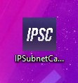
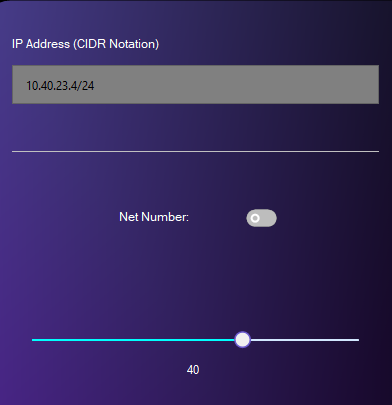
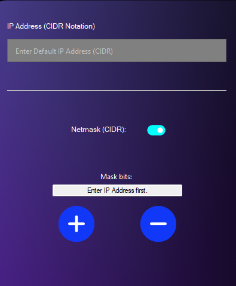

# IP Subnet Calculator

---

> A **Simple** but **complete C#** Windows application for calculating subnets by a given IP Address.
> 

---

## Screenshots:

---

---

## Features

- You can calculate **subnets** by **manually inserting a new subnet mask** (right screenshot), or **specifying the number of subnets you want to configure** (left screenshot): in the second case, the software will automatically choose a new subnet mask, showing it in both **binary** and **CIDR** notation.
- Every input has been **checked** and generates an handled exception.
- You can’t specify a subnet mask that is “**lower**” than the one you inserted as starting point, the software will automatically detect **CIDR** notation.
- The slider used to select the maximum number of subnets to calculate, is dinamically adjusted by the given subnet mask.
- Clicking with the mouse left button on the “Result” TextBox, will copy its content in the clipboard.

---

---

## Technologies Used

- **C#**
- **WinForms**
- “IPSubnet” from NuGET

---

## Usage

Download the “.exe” file from the release section and execute it, insert the starting IP and subnet mask in the upper left TextBox, and using the toggle switch below choose if you want to either specify a number of subnets to calculate, or manually insert a new subnet mask.

Click the “Generate” button to calculate the subnets.

---

## Contact

Created by @emikodes - feel free to contact me!

---

### For the “IPSubnet” library:

Copyright (c) 2015, lduchosal All rights reserved.

Redistribution and use in source and binary forms, with or without modification, are permitted provided that the following conditions are met:

- Redistributions of source code must retain the above copyright notice, this list of conditions and the following disclaimer.
- Redistributions in binary form must reproduce the above copyright notice, this list of conditions and the following disclaimer in the documentation and/or other materials provided with the distribution.

THIS SOFTWARE IS PROVIDED BY THE COPYRIGHT HOLDERS AND CONTRIBUTORS "AS IS" AND ANY EXPRESS OR IMPLIED WARRANTIES, INCLUDING, BUT NOT LIMITED TO, THE IMPLIED WARRANTIES OF MERCHANTABILITY AND FITNESS FOR A PARTICULAR PURPOSE ARE DISCLAIMED. IN NO EVENT SHALL THE COPYRIGHT HOLDER OR CONTRIBUTORS BE LIABLE FOR ANY DIRECT, INDIRECT, INCIDENTAL, SPECIAL, EXEMPLARY, OR CONSEQUENTIAL DAMAGES (INCLUDING, BUT NOT LIMITED TO, PROCUREMENT OF SUBSTITUTE GOODS OR SERVICES; LOSS OF USE, DATA, OR PROFITS; OR BUSINESS INTERRUPTION) HOWEVER CAUSED AND ON ANY THEORY OF LIABILITY, WHETHER IN CONTRACT, STRICT LIABILITY, OR TORT (INCLUDING NEGLIGENCE OR OTHERWISE) ARISING IN ANY WAY OUT OF THE USE OF THIS SOFTWARE, EVEN IF ADVISED OF THE POSSIBILITY OF SUCH DAMAGE.
